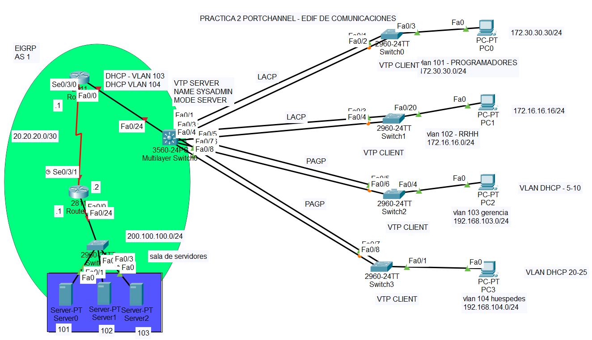

# Port-Channel

Dada la siguiente topología, levantar un servicio de portchannel, tomando en cuenta que el servicio de dhcp se levanta desde el servidor:



## Router - Router0 (superior)

- **encapsular las Vlans que se usaran en los servicios de DHCP**

```pkt
- Router(config)#int fa0/0.101
- Router(config-subif)#encapsulation dot1Q 101
- Router(config-subif)#ip address 172.30.30.1 255.255.255.0
- Router(config-subif)#no shut
- Router(config-subif)#exit

- Router(config)#int fa0/0.102
- Router(config-subif)#encapsulation dot1Q 102
- Router(config-subif)#ip address 172.16.16.1 255.255.255.0
- Router(config-subif)#no shut
- Router(config-subif)#exit

- Router(config)#int fa0/0.103
- Router(config-subif)#encapsulation dot1Q 103
- Router(config-subif)#ip address 192.168.103.1 255.255.255.0
- Router(config-subif)#no shut
- Router(config-subif)#exit

- Router(config)#int fa0/0.104
- Router(config-subif)#encapsulation dot1Q 104
- Router(config-subif)#ip address 192.168.104.1 255.255.255.0
- Router(config-subif)#no shut
```

- **Habilitar el puerto serial**

```pkt
- Router(config)#int s 0/3/0
- Router(config-if)#ip address 20.20.20.1 255.255.255.252
- Router(config-if)#no shut
```

- **Habilitar el servicio de EIGRP**

```pkt
- Router(config)#router eigrp 1
- Router(config-router)#network 20.20.20.0 0.0.0.255
- Router(config-router)#red static
- Router(config-router)#no auto-summary
```

## Router - Router1 (inferior)

- **Habilitar el puerto serial**

```pkt
Router(config)#int se0/3/1
Router(config-if)#ip address 20.20.20.2 255.255.255.0
Router(config-if)#clock rate 64000
Router(config-if)#no shut
```

- **habilitar el puerto de conexion con el switch**

```pkt
- Router(config)#int fa0/0
- Router(config-if)#ip address 200.100.100.1 255.255.255.0
- Router(config-if)#no shut
```

- **Habilitar el servicio de EIGRP**

```pkt
- Router(config)#router eigrp 1
- Router(config-router)#network 20.20.20.0 0.0.0.255
- Router(config-router)#network 200.100.100.0 0.0.0.255
- Router(config-router)#no auto-summary
```

## Multilayer switch 0

- **Levantar el servicio de VTP**

```pkt
- MultilayerSwitch0(config)#vtp domain diaD.com
- MultilayerSwitch0(config)#vtp password diaD
- MultilayerSwitch0(config)#vtp mode server
```

- **Levantar el servicio del port-channel**

```pkt
- MultilayerSwitch0(config)#int range fa0/1-8
- MultilayerSwitch0(config-if-range)#shut
- MultilayerSwitch0(config-if-range)#exit

- MultilayerSwitch0(config)#int range fa0/1-2
- MultilayerSwitch0(config-if-range)#channel-group 1 mode active

- MultilayerSwitch0(config-if-range)#int range fa0/3-4
- MultilayerSwitch0(config-if-range)#channel-group 2 mode active

- MultilayerSwitch0(config-if-range)#int range fa0/5-6
- MultilayerSwitch0(config-if-range)#channel-group 3 mode desirable

- MultilayerSwitch0(config-if-range)#int range fa0/7-8
- MultilayerSwitch0(config-if-range)#channel-group 4 mode desirable

- MultilayerSwitch0(config-if-range)#int range fa0/1-8
- MultilayerSwitch0(config-if-range)#no shut
- MultilayerSwitch0(config-if-range)#exit

- MultilayerSwitch0(config-if)#int port-channel 1
- MultilayerSwitch0(config-if)#switchport mode trunk
- MultilayerSwitch0(config-if)#int port-channel 2
- MultilayerSwitch0(config-if)#switchport mode trunk
```

## Switch0

- **Levantar el servicio VTP junto con el port-channel**

```pkt
- Switch0(config)#vtp
- Switch0(config)#int range fa0/1-2
- Switch0(config-if-range)#shut
- Switch0(config-if-range)#channel-group 1 mode active
- Switch0(config-if-range)#no shutdown
- Switch0(config-if-range)#exit
- Switch0(config)#int port-channel 1
- Switch0(config-if)#switchport mode trunk
```

- **Levantar servicio vtp**

```pkt
- Switch0(config)#vtp mode client
- Switch0(config)#vtp password diaD
- Switch0(config)#vtp domain diaD.com
```

- **Habilitacion de Vlans y port-channel**

```pkt
- Switch0(config)#interface fa0/3
- Switch0(config-if)#switchport mode access
- Switch0(config-if)#switchport access vlan 101
- Switch0(config-if)#exit
- Switch0(config)#interface port-channel 1
- Switch0(config-if)#switchport trunk allowed vlan 101
```

## Switch1

- **Levantar el port-channel**

```pkt
- Switch1(config)#int range fa0/3-4
- Switch1(config-if-range)#shut
- Switch1(config-if-range)#channel-group 2 mode active
- Switch1(config-if-range)#no shut
- Switch1(config-if-range)#exit
- Switch1(config)#int port-channel 2
- Switch1(config-if)#swi mode trunk
```

- **Levantar servicio vtp**

```pkt
- Switch1(config)#vtp mode client
- Switch1(config)#vtp password diaD
- Switch1(config)#vtp domain diaD.com
```

- **Estableciendo en modo troncal los puertos y el port-channel**

```pkt
- Switch1(config)#int port-channel 2
- Switch1(config-if)#swi mode trunk
- Switch1(config)#exit
- Switch1(config)#int fa0/3
- Switch1(config-if)#swi mode trunk
- Switch1(config-if)#exit
- Switch1(config)#int fa0/20
- Switch1(config-if)#swi mode access
- Switch1(config-if)#swi access vlan 102
- Switch1(config-if)#exit
- Switch1(config)#int port-channel 2
- Switch1(config-if)#swi trunk allowed vlan 102
```
