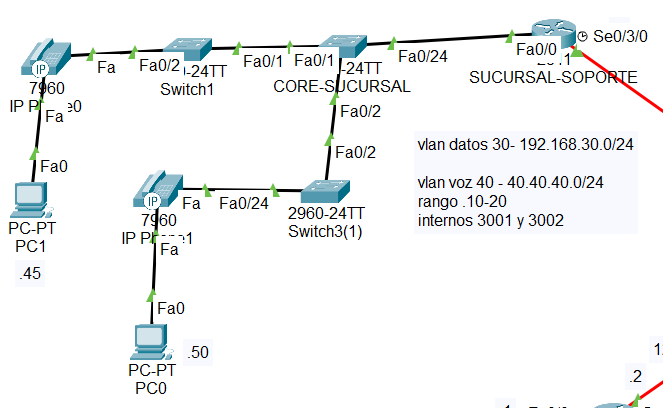

# Servicio de Telefonia

Dada la siguiente topología, levantar un servicio de telefonía:



## ROUTER - Sucursal soporte

- **Configuracion de subredes por medio de VLAN's**

```pkt
1. R1_SOPORTE(config)#int fa0/0.30
2. R1_SOPORTE(config-subif)#encapsulation dot1Q 30
3. R1_SOPORTE(config-subif)#ip address 192.168.30.1 255.255.255.0
4. R1_SOPORTE(config-subif)#no shut
```

```pkt
1. R1_SOPORTE(config)#int fa0/0.40
2. R1_SOPORTE(config-subif)#encapsulation dot1Q 40
3. R1_SOPORTE(config-subif)#ip address 40.40.40.1 255.255.255.0
4. R1_SOPORTE(config-subif)#no shut
```

- **Levantar el servicio de DHCP para el tema de VOZ**

```pkt
1. R1_SOPORTE(config)#ip dhcp pool VOICE
2. R1_SOPORTE(dhcp-config)#network 40.40.40.0 255.255.255.0
3. R1_SOPORTE(dhcp-config)#default-router 40.40.40.1
4. R1_SOPORTE(dhcp-config)#option 150 ip 40.40.40.1
5. R1_SOPORTE(dhcp-config)#exit
#Si se desea establecer que direcciones IP no se deben tomar, se debe tomar en cuenta el siguiente comando:
6. R1_SOPORTE(config)#ip dhcp excluded-address 40.40.40.1 40.40.40.9
7. R1_SOPORTE(config)#ip dhcp excluded-address 40.40.40.21 40.40.40.255
```

- **Levantar el servicio de telefonia**

```pkt
1. R1_SOPORTE(config)#telephony-service
2. R1_SOPORTE(config-telephony)#max-ephones 2 #en este caso solo necesitamos 2 telefonos
3. R1_SOPORTE(config-telephony)#max-dn 2
4. R1_SOPORTE(config-telephony)#ip source-address 40.40.40.1 port 2000 #el puerto puede variar
5. R1_SOPORTE(config-telephony)#auto assign 1 to 2
```

- **Asignar numeros a los telefonos**

```pkt
1. R1_SOPORTE(config)#ephone-dn 1
2. R1_SOPORTE(config-ephone-dn)#number 3001
3. R1_SOPORTE(config-ephone-dn)#exit
4. R1_SOPORTE(config)#ephone-dn 2
5. R1_SOPORTE(config-ephone-dn)#number 3002
```

## Switch - Core Sucursal

- **Creacion de Vlans**

```pkt
1. S_CORE_SUCURSAL(config)#vlan 30
2. S_CORE_SUCURSAL(config-vlan)#name datos
3. S_CORE_SUCURSAL(config-vlan)#exit
4. S_CORE_SUCURSAL(config)#vlan 40
5. S_CORE_SUCURSAL(config-vlan)#name voz
```

- **Estableciendo las troncales para las Vlans, en los puertos conectados a otros switches**

```pkt
1. S_CORE_SUCURSAL(config)#int range fa0/1-2
2. S_CORE_SUCURSAL(config-if)#swi mode trunk
3. S_CORE_SUCURSAL(config-if)#swi trunk allowed vlan 30,40
4. S_CORE_SUCURSAL(config-if)#no shut
5. S_CORE_SUCURSAL(config-if)#exit
6. S_CORE_SUCURSAL(config)#int fa0/24
7. S_CORE_SUCURSAL(config-if)#swi mode trunk
8. S_CORE_SUCURSAL(config-if)#swi trunk allowed vlan 30,40
```

## Switch - Switch3(1)

- **Creacion de Vlans**

```pkt
1. S_Switch3(1)(config)#vlan 30
2. S_Switch3(1)(config-vlan)#name datos
3. S_Switch3(1)(config-vlan)#exit
4. S_Switch3(1)(config)#vlan 40
5. S_Switch3(1)(config-vlan)#name voz
```

- **Estableciendo las troncales para las Vlans, en los puertos conectados a otros switches**

```pkt
1. S_Switch3(1)(config)#int range fa0/2
2. S_Switch3(1)(config-if)#swi mode trunk
3. S_Switch3(1)(config-if)#swi trunk allowed vlan 30,40
4. S_Switch3(1)(config-if)#no shut
```

- **Brindando acceso a un puerto a las Vlans**

```pkt
1. S_Switch3(1)(config)#int fa0/24
2. S_Switch3(1)(config-if)#swi access vlan 30
3. S_Switch3(1)(config-if)#swi voice vlan 40
4. S_Switch3(1)(config-if)#no shut
```

## Switch - Switch1

- **Creacion de Vlans**

```pkt
1. S_Switch1(config)#vlan 30
2. S_Switch1(config-vlan)#name datos
3. S_Switch1(config-vlan)#exit
4. S_Switch1(config)#vlan 40
5. S_Switch1(config-vlan)#name voz
```

- **Estableciendo las troncales para las Vlans, en los puertos conectados a otros switches**

```pkt
1. S_Switch1(config)#int range fa0/1
2. S_Switch1(config-if)#swi mode trunk
3. S_Switch1(config-if)#swi trunk allowed vlan 30,40
4. S_Switch1(config-if)#no shut
```

- **Brindando acceso a un puerto a las Vlans**

```pkt
1. S_Switch1(config)#int fa0/2
2. S_Switch1(config-if)#swi access vlan 30
3. S_Switch1(config-if)#swi voice vlan 40
4. S_Switch1(config-if)#no shut
```

- **Finalmente solo quedaria conectar y activar los telefonos**
